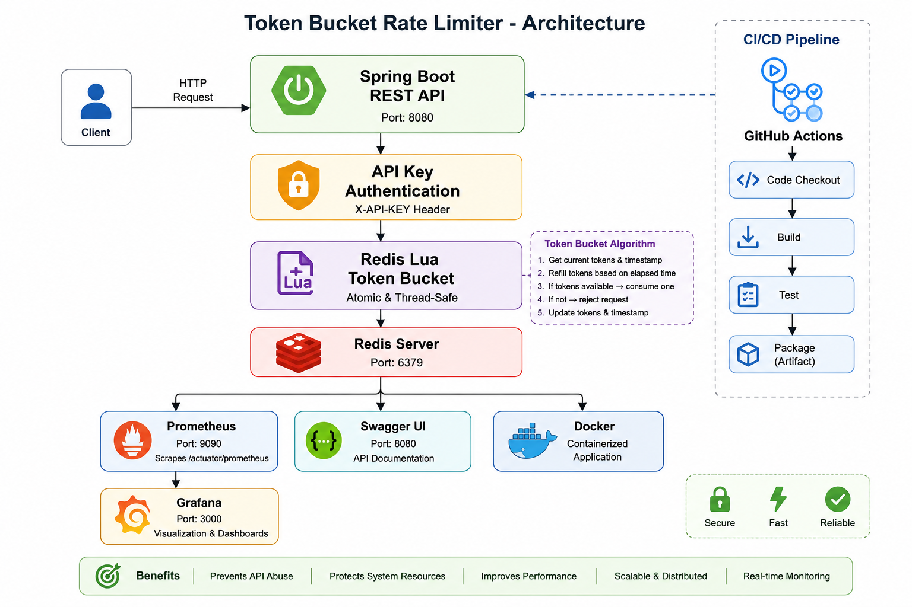

# 🚀 Token Bucket Rate Limiter

A **production-grade distributed Token Bucket Rate Limiter** built using **Spring Boot**, **Redis**, **Lua Scripting**, **Docker**, **Prometheus**, **Grafana**, **GitHub Actions**, and **k6**.

This project demonstrates how modern backend systems implement scalable and thread-safe API rate limiting using Redis with atomic Lua scripts while providing monitoring, observability, and automated CI/CD.

---

# ✨ Features

- 🚀 Token Bucket Rate Limiting Algorithm
- 🔥 Atomic Redis Lua Script
- 🔐 API Key Authentication
- 📚 Swagger/OpenAPI Documentation
- 📊 Prometheus Metrics
- 📈 Grafana Monitoring Dashboard
- 🐳 Docker Support
- 🐳 Docker Compose Setup
- ⚡ Redis-based Distributed Storage
- 📦 RESTful APIs
- 🛡 Global Exception Handling
- 📈 Micrometer Metrics
- 🚀 k6 Load Testing
- ✅ GitHub Actions CI Pipeline

---

# 🏗 Architecture


---

# 🛠 Tech Stack

| Category | Technology |
|-----------|------------|
| Language | Java 21 |
| Framework | Spring Boot |
| Build Tool | Maven |
| Database | Redis |
| API Documentation | Swagger / OpenAPI |
| Monitoring | Prometheus |
| Dashboard | Grafana |
| Metrics | Micrometer |
| Load Testing | k6 |
| Containerization | Docker |
| Orchestration | Docker Compose |
| CI/CD | GitHub Actions |

---

# 📂 Project Structure

```text
token-bucket-rate-limiter/
│
├── .github/
│   └── workflows/
│       └── ci.yml
│
├── src/
│   ├── main/
│   │
│   ├── controller/
│   ├── service/
│   ├── repository/
│   ├── security/
│   ├── config/
│   ├── metrics/
│   ├── exception/
│   ├── dto/
│   ├── model/
│   │
│   └── resources/
│       ├── scripts/
│       │    └── tokenBucket.lua
│       └── application.properties
│
├── Dockerfile
├── docker-compose.yml
├── prometheus.yml
├── load-test.js
├── pom.xml
└── README.md
```

---

# 🚀 API Endpoints

## Register Client

```http
POST /api/clients
```

### Request

```json
{
  "clientId": "raghav",
  "capacity": 10,
  "refillRate": 2
}
```

### Response

```text
Client Registered Successfully
```

---

## Consume Token

```http
POST /api/allow
```

### Headers

```text
X-API-KEY: raghav-secret-key
```

### Request

```json
{
  "clientId":"raghav"
}
```

### Response

```json
{
  "allowed": true,
  "remainingTokens": 9
}
```

---

# 🔐 Security

The application uses API Key Authentication.

Include the following header with every protected request:

```text
X-API-KEY: raghav-secret-key
```

Swagger, Prometheus and Actuator endpoints are publicly accessible.

---

# ⚡ Token Bucket Algorithm

Each client has:

- Capacity
- Available Tokens
- Refill Rate
- Last Refill Timestamp

For every incoming request:

1. Calculate elapsed time
2. Refill tokens
3. Consume one token if available
4. Reject request if bucket is empty

---

# 🔥 Redis Lua Script

Instead of performing multiple Redis operations, the rate limiting logic is executed inside Redis using Lua scripting.

Advantages:

- Atomic execution
- No race conditions
- Faster execution
- Distributed-safe
- Production-ready implementation

---

# 📊 Monitoring

The project exports application metrics using Micrometer.

Prometheus scrapes metrics from

```
/actuator/prometheus
```

Grafana visualizes

- Total Requests
- Allowed Requests
- Blocked Requests
- Request Latency
- JVM Metrics
- Memory Usage

---

# 📈 Load Testing

Load testing is performed using **k6**.

Example:

```bash
k6 run load-test.js
```

Example Result

```
100 Virtual Users
30 Seconds

2900 Requests

0 Failed Requests

Average Latency : 61 ms

Throughput : 93 Requests/sec
```

---

# 🐳 Docker

Run complete project

```bash
docker compose up --build
```

Services

| Service | Port |
|----------|------|
| Spring Boot | 8080 |
| Redis | 6379 |
| Prometheus | 9090 |
| Grafana | 3000 |

---

# 📚 Swagger

Swagger UI

```
http://localhost:8080/swagger-ui/index.html
```

---

# 📊 Prometheus

```
http://localhost:9090
```

---

# 📈 Grafana

```
http://localhost:3000
```

Default Credentials

Username

```
admin
```

Password

```
admin
```

---

# 🚀 CI/CD

GitHub Actions automatically

- Builds project
- Runs tests
- Validates every push
- Supports Pull Requests

---

# 🧪 Testing

Run the application

```bash
./mvnw spring-boot:run
```

Run Docker

```bash
docker compose up --build
```

Run Load Test

```bash
k6 run load-test.js
```

---

# 📸 Screenshots

Add screenshots here:

- Swagger UI
- Grafana Dashboard
- Prometheus Targets
- GitHub Actions
- k6 Load Test Results

---

# 🚀 Future Improvements

- Sliding Window Rate Limiter
- Leaky Bucket Algorithm
- User Authentication with JWT
- Dynamic Rate Limits
- Clustered Redis
- Kubernetes Deployment
- Helm Charts
- Distributed Tracing
- AWS Deployment

---

# 👨‍💻 Author

**Raghav Gupta**

- GitHub: https://github.com/raghavguptaa7
- LinkedIn: *(Add your LinkedIn profile here)*

---

# ⭐ If you found this project useful, consider giving it a star.